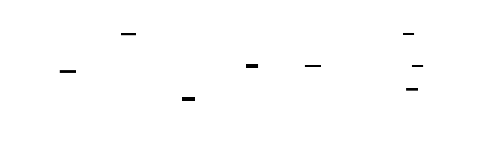

# Viaduck — DuckLake to DuckLake CDC Replication

A standalone Python app that replicates data from a source DuckLake table to N destination DuckLake tables using CDC (Change Data Capture). Supports inserts, deletes, and updates. Single thread, single poll loop, no framework.

**Contents:**
[Naming](#naming) | [What](#what) | [Why](#why) | [Architecture](#architecture) | [Two Modes](#two-modes) | [Poll Cycle](#poll-cycle) | [CDC Operations](#cdc-operations-and-semantics) | [Failure Modes](#failure-modes) | [Configuration](#configuration) | [State Tracking](#state-tracking) | [Seeding](#new-destination-seeding) | [Connection Management](#connection-management) | [Horizontal Scaling](#horizontal-scaling) | [Metrics](#metrics) | [Setup](#setup) | [Development](#development) | [Formal Verification](#formal-verification-tla) | [Deployment](#deployment) | [Error Handling](#error-handling-and-retries)

## Naming


> **viaduct** (noun): a long bridge-like structure carrying a road or railroad across a valley or other low ground.

Viaduck carries data across DuckLakes. The name is a portmanteau of *viaduct* and *duck*, because [DuckLake](https://github.com/duckdb/ducklake) and because [Why A Duck?](https://www.youtube.com/watch?v=kHMrLpDHXc0).

## What

- CDC replication from one source DuckLake table to N destination DuckLake tables
- Routes rows by a configurable field (e.g. `company`) to per-tenant destinations
- Full CDC: inserts, deletes, and updates (not just append-only)
- 3-phase algorithm: preimage resolution, conflict resolution, atomic transactional apply
- Scan-based seeding for new destinations (no full history replay)
- YAML config with env var indirection for credentials
- Per-destination error isolation — one broken destination doesn't block others
- LRU connection pool for high fanout (100s-1000s of destinations)
- Persistent cursor tracking on the source catalog
- Horizontal scaling via hash or explicit destination partitioning
- 19 Prometheus metrics, health checks (`/healthz`, `/readyz`)
- At-least-once delivery with documented failure modes
- [TLA+ formally verified](tla/Viaduck.tla): 5 safety invariants checked across 730K states

## Why

Multi-tenant DuckLake architectures need per-tenant table isolation — separate catalogs, separate S3 paths, separate Postgres metadata stores. Viaduck reads CDC changes from a shared source table, routes rows by a configurable field (e.g. `company`), and writes each partition to the correct tenant's DuckLake. Think of it as a data viaduct with N exits.

```
loop:
  current_snapshot() on source
  group destinations by cursor position
  for each group:
    table_changes(start, end, filter_expr)  → CDC read (inserts + deletes + updates)
    resolve preimages                        → handle cross-tenant migration
    split by routing field                   → Arrow routing
    resolve conflicts                        → cancel insert+delete pairs
    delete + upsert (in transaction)         → atomic apply
    advance_cursor() in transaction          → state update
```

Single thread, single loop. DuckLake snapshots are the cursor. State is tracked on the source catalog. Designed for high fanout (100s-1000s of destinations).

## Architecture



Source: [`docs/architecture.d2`](docs/architecture.d2)

Each viaduck instance consumes from one source table and writes to N destination DuckLakes. The source and every destination are independent catalogs with their own Postgres metadata store and S3 data path. No cross-catalog transactions are possible.

Core modules:

| Module | Responsibility | Source |
|--------|---------------|--------|
| [`main.py`](viaduck/main.py) | Poll loop, 3-phase CDC apply, signal handling, retry logic | Entry point |
| [`config.py`](viaduck/config.py) | YAML parsing, env var resolution, validation | Configuration |
| [`source.py`](viaduck/source.py) | Source catalog connection, CDC reading (`table_changes` / `table_insertions`) | CDC |
| [`router.py`](viaduck/router.py) | Arrow splitting by routing field | Routing |
| [`destination.py`](viaduck/destination.py) | LRU connection pool for destination catalogs | Connections |
| [`state.py`](viaduck/state.py) | `_viaduck_state` table CRUD on source | State tracking |
| [`metrics.py`](viaduck/metrics.py) | Prometheus metric definitions | Observability |
| [`server.py`](viaduck/server.py) | HTTP `/metrics`, `/healthz`, `/readyz` | Health checks |

## Two Modes

Viaduck operates in one of two modes based on the `key_columns` configuration:

| Mode | Config | CDC API | Destination writes | Use case |
|------|--------|---------|-------------------|----------|
| **Append-only** | `key_columns` omitted or `[]` | `table_insertions()` | `append()` | Append-only tables, no primary key |
| **Full CDC** | `key_columns: [event_id]` | `table_changes()` | `delete()` + `upsert()` | Tables with primary keys, full replication |

## Poll Cycle


Source: [`docs/poll-cycle.d2`](docs/poll-cycle.d2)

Each poll cycle ([`main.py:_poll_cycle`](viaduck/main.py)):

1. **Snapshot check** — `current_snapshot()` on the source table. If no snapshots exist, sleep and retry.
2. **Load cursors** — read `_viaduck_state` to get each destination's `last_snapshot_id`. Uses filter pushdown with `In` + `EqualTo` expressions ([`state.py:load_cursors`](viaduck/state.py)).
3. **Group by cursor** — destinations at the same snapshot share a single CDC read ([`main.py:_group_by_cursor`](viaduck/main.py)). This avoids re-reading data for caught-up destinations.
4. **CDC read** — In full CDC mode: `table_changes(start, end, filter_expr)` reads inserts, deletes, and update pre/post images. In append-only mode: `table_insertions(start, end, filter_expr)` reads inserts only. Both use SQL `IN` pushdown ([`source.py`](viaduck/source.py)).
5. **Phase 1: Preimage Resolution** *(full CDC only)* — pair `update_preimage` with `update_postimage` rows by `rowid`. If routing values differ (cross-tenant migration), convert preimage to a delete on the old destination. Drop same-tenant preimages (upsert handles them). Convert orphaned preimages to deletes ([`main.py:_resolve_preimages`](viaduck/main.py)).
6. **Route** — `split_and_count()` uses PyArrow compute to partition the Arrow table by routing field value in a single pass. Counts unrouted rows ([`router.py:split_and_count`](viaduck/router.py)).
7. **Phase 2: Conflict Resolution** *(full CDC only)* — within each per-destination batch, cancel `insert + delete` pairs for the same `rowid` (net no-op). Drop `update_postimage` rows shadowed by a delete for the same `rowid` ([`main.py:_resolve_conflicts`](viaduck/main.py)).
8. **Phase 3: Apply** *(full CDC only)* — within a destination `catalog.begin_transaction()`: delete matching rows first, then upsert inserts + postimages. Atomic — crash during apply triggers rollback ([`main.py:_apply_changes`](viaduck/main.py)). In append-only mode: `append()` only.
9. **Advance cursor** — `delete` + `insert` within a pyducklake `begin_transaction()` on the source catalog ([`state.py:advance_cursor`](viaduck/state.py)).
10. **Lag metrics** — update per-destination snapshot lag gauges.

## CDC Operations and Semantics

### What CDC events are supported

| Operation | Append-only mode | Full CDC mode | Notes |
|-----------|-----------------|---------------|-------|
| INSERT | Yes | Yes | Core use case. Rows inserted between snapshots are read and routed. |
| DELETE | No | Yes | Deleted rows are replicated via `table.delete(filter)` on destinations. Requires `key_columns`. |
| UPDATE | No | Yes | DuckLake models updates as preimage + postimage. Viaduck upserts postimages via `table.upsert(df, key_columns)`. |
| Cross-tenant UPDATE | No | Yes | When an update changes the routing value (e.g. `company`), the row is deleted from the old destination and inserted to the new one. Metricked via `viaduck_cdc_routing_mutations_total`. |
| Schema evolution | Partial | Partial | New source columns included in CDC reads. Destination schemas not auto-evolved. Restart viaduck for new destinations to get updated schema. |

### CDC permutations handled

| Scenario | Behavior | Tested |
|----------|----------|--------|
| No snapshots on source | Poll returns early, sleeps | [`test_poll_cycle_no_snapshots`](tests/unit/test_main.py) |
| All destinations caught up | No CDC reads, no writes | [`test_poll_cycle_all_caught_up`](tests/unit/test_main.py) |
| Empty changeset | Cursors advanced without writing | [`test_poll_cycle_empty_changeset_advances_cursors`](tests/unit/test_main.py) |
| Destinations at different snapshots | Grouped CDC reads — one per distinct cursor position | [`test_group_by_cursor_mixed`](tests/unit/test_main.py) |
| New destination (no prior state) | Initialized at snapshot 0, replays full history | [`test_initialize_destinations_creates_new`](tests/unit/test_state.py) |
| Rows with no matching destination | Counted as unrouted, metricked, silently dropped | [`test_split_string_no_match`](tests/unit/test_router.py) |
| NULL values in routing column | Not routed, counted as unrouted | [`test_split_null_values_not_routed`](tests/unit/test_router.py) |
| Routing field missing from schema | `RoutingError` raised, group processing halted | [`test_poll_cycle_routing_error_breaks_gracefully`](tests/unit/test_main.py) |
| Insert then delete same row in range | Conflict resolution cancels both — net no-op | [`test_resolve_conflicts_insert_delete_cancel`](tests/unit/test_main.py), [`test_torture_insert_update_delete_same_key`](tests/unit/test_main.py) |
| Update then delete same row | Postimage dropped, delete kept — row removed | [`test_resolve_conflicts_update_delete_keeps_delete`](tests/unit/test_main.py) |
| Same key, different logical rows | NOT cancelled — uses `rowid` to distinguish | [`test_resolve_conflicts_same_key_different_rowid_no_cancel`](tests/unit/test_main.py) |
| Cross-tenant row migration | Preimage → delete on old dest, postimage → upsert on new dest | [`test_resolve_preimages_cross_tenant_converts_to_delete`](tests/unit/test_main.py), [`test_torture_routing_value_mutation_cross_tenant`](tests/unit/test_main.py) |
| Orphaned preimage (no postimage) | Converted to delete (defensive) | [`test_resolve_preimages_orphaned_converts_to_delete`](tests/unit/test_main.py) |
| NULL in key column | Delete filter uses `IS NULL` | [`test_build_delete_filter_null_in_key`](tests/unit/test_main.py), [`test_torture_delete_filter_null_composite_key`](tests/unit/test_main.py) |
| Delete-only changeset | Only deletes applied, cursor advanced | [`test_apply_changes_deletes_only`](tests/unit/test_main.py) |

### Delivery guarantees

**At-least-once.** There is no cross-catalog transaction support in DuckLake. The write-then-advance-cursor pattern means:

- If the process crashes **after writing** to a destination but **before advancing the cursor**, the next poll will re-read the same CDC range and re-write the same rows. Destinations must tolerate duplicates.
- If the process crashes **during the cursor transaction**, the transaction is rolled back and the cursor stays at its previous value. The same data is re-read and re-written. No data loss.
- In full CDC mode, deletes + upserts on each destination are applied within a **single transaction**. A crash mid-apply rolls back both — no partial state.
- If a destination write fails, the cursor is not advanced for that destination. Other destinations are unaffected.

There is **no data loss path**. The source DuckLake's snapshot history is the durable log.

## Failure Modes


Source: [`docs/failure-modes.d2`](docs/failure-modes.d2)

| Failure | Impact | Recovery | Isolation |
|---------|--------|----------|-----------|
| Source catalog unavailable | CDC read fails | Fatal — crash, K8s restart, resume from last cursor | All destinations blocked |
| Destination catalog unavailable | Write fails | 3 retries with backoff ([`main.py:_write_with_retry`](viaduck/main.py)), then error recorded, connection evicted. Cursor not advanced — automatic retry next poll. | **Per-destination** — other destinations unaffected ([`test_poll_cycle_handles_write_failure`](tests/unit/test_main.py)) |
| Crash after write, before state update | Destination has data but cursor not advanced | At-least-once: re-reads and re-writes on restart. Duplicates possible. | Per-destination |
| State transaction failure | `delete` + `insert` rolled back | Cursor preserved at old value. Same data retried next poll. | Per-destination |
| Destination apply failure (full CDC) | Delete + upsert transaction rolled back | No partial state on destination. Retried next poll. | Per-destination |
| Routing field missing from source | `RoutingError` halts group processing | Error metricked, logged. Requires config or schema fix. | All destinations in group |
| Connection pool eviction storm | Frequent close/reopen | Automatic via LRU. Increase `max_open` if thrashing. | Performance, not correctness |

## Not Yet Supported

- **Dynamic destination discovery** — destinations are defined statically in YAML. No runtime discovery from a DuckLake table.
- **Schema evolution propagation** — source schema changes are not automatically applied to existing destination tables. Requires viaduck restart.
- **Exactly-once delivery** — at-least-once only. No deduplication layer.
- **Batching / coalescing** — writes are immediate per poll cycle. No local buffering across cycles to reduce small file count.
- **Web UI** — planned SSE-based status page, not yet implemented.
- **E2E tests** — automated docker-compose test suite not yet implemented.

## Configuration

Config via YAML file (default: `viaduck.yaml`). Credentials are never in the YAML — use `_env` suffix to reference environment variables.

```yaml
source:
  name: "source"
  postgres_uri_env: "SOURCE_POSTGRES_URI"   # env var containing the connection string
  data_path: "s3://source-bucket/data"
  table: "events"
  properties:
    s3_endpoint: "minio:9000"
    s3_access_key_id_env: "S3_ACCESS_KEY_ID"  # _env suffix → read from env var
    s3_secret_access_key_env: "S3_SECRET_ACCESS_KEY"
    s3_use_ssl: "false"
    s3_url_style: "path"

routing:
  field: "company"                           # column in source table to route on
  key_columns: ["event_id"]                  # primary key for delete/update replication
                                             # omit or [] for append-only mode
  seed_mode: "scan"                          # "scan" (default) or "cdc_replay"

destinations:
  - id: "quacksworth-lake"                   # internal identifier (state tracking, logs)
    routing_value: "quacksworth"             # rows where company='quacksworth' go here
    name: "quacksworth_catalog"
    postgres_uri_env: "DEST_QUACKSWORTH_POSTGRES_URI"
    data_path: "s3://quacksworth-data/"
    table: "events"                          # defaults to source table name if omitted

  - id: "mallardine-lake"
    routing_value: "mallardine"
    name: "mallardine_catalog"
    postgres_uri_env: "DEST_MALLARDINE_POSTGRES_URI"
    data_path: "s3://mallardine-data/"

defaults:
  properties:                                # inherited by all destinations
    s3_endpoint: "minio:9000"
    s3_use_ssl: "false"
    s3_url_style: "path"

poll:
  interval_seconds: 5                       # how often to poll for new snapshots

server:
  port: 8000                                # Prometheus metrics + health checks

instance:
  id: "viaduck-0"                           # unique per scaling instance
  partition:
    mode: "all"                             # all | explicit | hash
    # explicit: include: ["quacksworth-lake", "mallardine-lake"]
    # hash: total: 4, ordinal: 0
```

Config parsing and validation: [`config.py`](viaduck/config.py), tests: [`test_config.py`](tests/unit/test_config.py).

Routing values can be strings or integers (YAML unquoted integers are coerced to strings). The router detects the source column's Arrow type at runtime and casts accordingly ([`router.py:_make_scalar`](viaduck/router.py)).

### Routing column immutability

**The routing column must not be updated.** Viaduck assumes the routing field value is immutable for the lifetime of a row. This is a design constraint that enables efficient CDC filter pushdown — the `filter_expr` in `table_changes()` only includes the current destination routing values, which would miss preimages whose routing value was changed to a value outside the current set.

If a routing column mutation is detected (e.g. via an UPDATE that changes `company`), viaduck handles it defensively (delete from old destination, upsert to new) and logs an ERROR with the `viaduck_cdc_routing_mutations_total` metric. However, **data integrity is not guaranteed** in this case — other preimages may have been dropped by the filter pushdown.

### Reserved column names

When using full CDC mode (`key_columns` configured), the source table must not use the column names `change_type`, `snapshot_id`, or `rowid`. These are metadata columns injected by DuckLake's `ducklake_table_changes()` function and are stripped before writing to destinations.

## State Tracking

Viaduck stores per-destination replication cursors in a `_viaduck_state` table on the **source** DuckLake catalog ([`state.py`](viaduck/state.py)):

| Column | Type | Purpose |
|--------|------|---------|
| `destination_id` | VARCHAR | Which destination (e.g. "quacksworth-lake") |
| `instance_id` | VARCHAR | Which viaduck instance owns this cursor |
| `last_snapshot_id` | BIGINT | Last successfully replicated source snapshot |
| `rows_replicated` | BIGINT | Cumulative operations applied to this destination |
| `last_error` | VARCHAR | Last error message (NULL if healthy) |
| `updated_at` | TIMESTAMPTZ | When this row was last modified |

State updates use `begin_transaction()` for atomicity — the delete + insert pair either both commit or both roll back ([`state.py:advance_cursor`](viaduck/state.py), tested: [`test_advance_cursor_uses_transaction`](tests/unit/test_state.py)).

State is keyed by `(destination_id, instance_id)`, enabling multiple viaduck instances to independently track their assigned destinations without conflicts.

## New Destination Seeding

When a new destination is added to the config, it needs the current source data. Two modes are available via `routing.seed_mode`:

| Mode | How it works | When to use |
|------|-------------|-------------|
| `scan` (default) | Reads current source state via filtered `table.scan()`, bulk-loads the destination, sets cursor to current snapshot | Most use cases. Fast — reads one snapshot, not historical CDC. |
| `cdc_replay` | Starts cursor at snapshot 0, replays entire CDC history on first poll | Audit trails where you need to process every historical change |

With `scan` mode, adding a new tenant is instant regardless of source history depth. The scan is pinned to the snapshot captured at startup, so no race condition between the scan and cursor advancement ([`main.py:_seed_new_destinations`](viaduck/main.py)).

When `key_columns` is configured, seeding uses `upsert` for idempotency — safe if the process crashes mid-seed and re-seeds on restart. Without `key_columns`, seeding uses `append` (at-least-once semantics apply).

Verified by TLC: the `SeedDestination` action in the TLA+ spec produces the same invariant-satisfying state as a full CDC replay ([`tla/Viaduck.tla`](tla/Viaduck.tla)).

## Connection Management

With 1000s of destinations, holding all connections open is not viable (~20-30MB per DuckDB catalog connection). Viaduck uses an LRU pool ([`destination.py:DestinationPool`](viaduck/destination.py)):

- **Lazy initialization** — connections created on first access
- **LRU eviction** — when at capacity (`max_open`, default 50), the least recently used connection is closed
- **Error eviction** — failed connections are evicted immediately and recreated on next access
- **Schema caching** — source table schema fetched once at startup, reused for all destination table creation

Metrics: `viaduck_pool_open_connections`, `viaduck_pool_evictions_total`, `viaduck_pool_creates_total`.

Tests: [`test_destination.py`](tests/unit/test_destination.py) — LRU ordering, eviction, error handling, `max_open` validation.

## Horizontal Scaling

Three partition modes ([`config.py:assigned_destination_ids`](viaduck/config.py)):

| Mode | How it works | Use case |
|------|-------------|----------|
| `all` (default) | Single instance handles all destinations | Small deployments |
| `explicit` | YAML lists destination IDs for this instance | Operator-controlled assignment |
| `hash` | `md5(destination_id) % total == ordinal` | Automatic, no coordination |

Each instance only processes its assigned destinations. State rows are keyed by `instance_id`, so instances don't conflict.

## Metrics

19 Prometheus metrics exposed on `GET /metrics` (port 8000). Pipeline label auto-injected ([`metrics.py`](viaduck/metrics.py)):

| Metric | Type | Labels | Description |
|--------|------|--------|-------------|
| `viaduck_polls_total` | Counter | — | Poll cycles executed |
| `viaduck_cdc_read_seconds` | Histogram | — | Time to read CDC from source |
| `viaduck_cdc_rows_read_total` | Counter | — | Total rows read from source |
| `viaduck_cdc_batch_rows` | Histogram | — | Rows per CDC read (monitors batch sizes; large values indicate poll interval too slow) |
| `viaduck_source_snapshot_id` | Gauge | — | Current source snapshot ID |
| `viaduck_dest_write_seconds` | Histogram | destination | Time per destination write |
| `viaduck_dest_rows_written_total` | Counter | destination | Rows appended (append-only mode) |
| `viaduck_dest_rows_deleted_total` | Counter | destination | Rows deleted via CDC |
| `viaduck_dest_rows_upserted_total` | Counter | destination | Rows sent to upsert (input count) |
| `viaduck_dest_upsert_matched_total` | Counter | destination | Rows that matched existing rows during upsert (updates vs inserts) |
| `viaduck_dest_last_snapshot_id` | Gauge | destination | Last replicated snapshot |
| `viaduck_dest_lag_snapshots` | Gauge | destination | Snapshot lag per destination |
| `viaduck_unrouted_rows_total` | Counter | — | Rows with no matching destination |
| `viaduck_pool_open_connections` | Gauge | — | Open destination connections |
| `viaduck_pool_evictions_total` | Counter | — | LRU evictions |
| `viaduck_cdc_routing_mutations_total` | Counter | — | Cross-tenant routing value changes |
| `viaduck_cdc_conflicts_resolved_total` | Counter | — | Insert+delete pairs cancelled |
| `viaduck_cdc_orphaned_preimages_total` | Counter | — | Preimages with no matching postimage |
| `viaduck_errors_total` | Counter | type, destination | Errors by type |

## Setup

```bash
just sync              # install dependencies
just run -- -c my.yaml # run with config file
```

## Development

```bash
just fmt               # format code
just lint              # lint code
just test              # run unit tests
just test-integration  # run integration tests (local DuckDB)
just test-perf         # run performance benchmarks
just test-perf-json    # benchmarks + JSON output to perf-results.json
just ci                # format check + lint + unit tests + docs check
just docs              # render d2 diagrams to SVG
just docs-check        # verify all README links are valid
just up                # start docker-compose stack
just down              # stop docker-compose stack
```

### Performance benchmarks

7 benchmarks in [`tests/perf/test_fanout_perf.py`](tests/perf/test_fanout_perf.py) exercise the hot path at scale:

| Benchmark | Scale | Budget | Typical |
|-----------|-------|--------|---------|
| Router split | 10K rows, 100 dests | <1s | ~4ms |
| Router split | 100K rows, 1000 dests | <5s | ~160ms |
| Router split | 1M rows, 10K dests | <60s | ~16s |
| Preimage resolution | 50K CDC rows | <2s | ~55ms |
| Conflict resolution | 50K rows, ~5% conflicts | <1s | ~45ms |
| Delete filter (single key) | 1000 rows | <1s | ~18ms |
| Delete filter (composite key) | 500 rows, 3-col key | <2s | ~2ms |

`just test-perf-json` writes results to `perf-results.json` for CI regression tracking.

### Grafana dashboard

A [Grafana dashboard](grafana/dashboards/viaduck.json) covering all 19 metrics is included. Available at `http://localhost:3000/d/viaduck/viaduck` when running `just up`.

## Deployment

```bash
kubectl apply -f k8s/service.yaml
kubectl apply -f k8s/pdb.yaml
kubectl apply -f k8s/deployment.yaml
```

Viaduck runs as a K8s Deployment (not StatefulSet — no ordinal-based identity needed). For horizontal scaling, deploy multiple instances with different `instance.partition` configs. See [`k8s/deployment.yaml`](k8s/deployment.yaml) for manifests.

## Error Handling and Retries

| Operation | Attempts | Backoff | On exhaustion |
|-----------|----------|---------|---------------|
| Destination write | 3 | 1s, 2s | Error recorded, connection evicted, cursor not advanced. Automatic retry next poll. Other destinations unaffected. |
| Source CDC read | 1 | — | Fatal — crash, K8s restart, resume from cursors. |
| State update | 1 (transactional) | — | Transaction rolled back, cursor preserved. Retry next poll. |

Why crash on source failure? The source catalog is the single point of truth. If it's unreachable, there's nothing to do. Let K8s handle the restart. DuckLake snapshot history ensures no data loss.

---

MIT License. Copyright (c) 2026 PostHog, Inc.

### Photo
[By AndyScott - Own work, CC BY-SA 4.](https://commons.wikimedia.org/w/index.php?curid=92763727)
