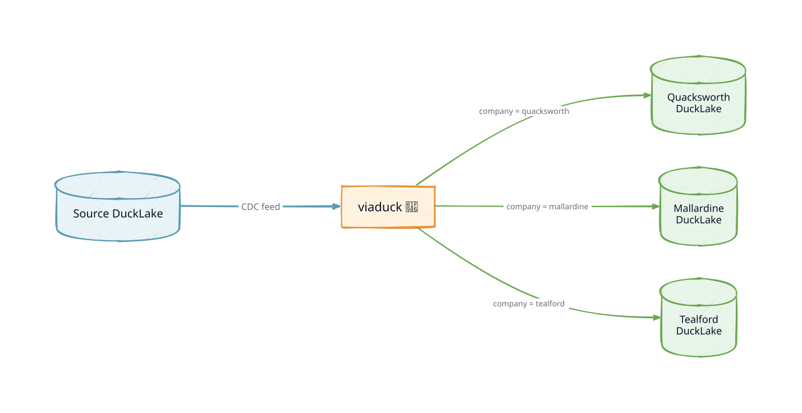
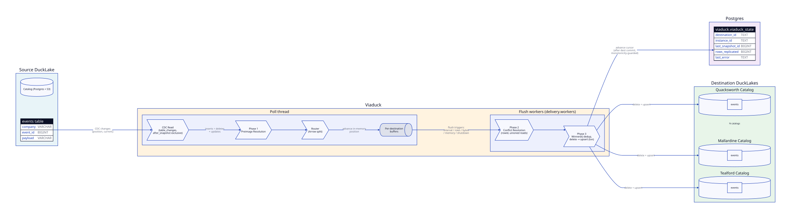
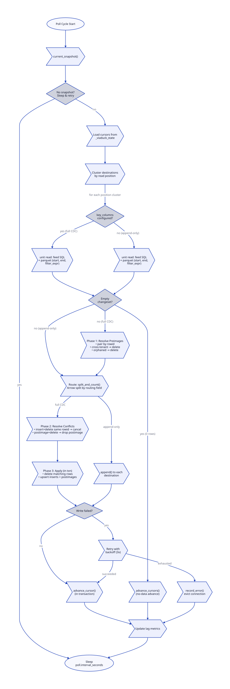

# Viaduck — DuckLake to DuckLake CDC Replication

A standalone Python app that replicates data from a source DuckLake table to N destination DuckLake tables using CDC (Change Data Capture). Supports inserts, deletes, and updates. Single thread, single poll loop, no framework.

**Contents:**
[Naming](#naming) | [What](#what) | [Why](#why) | [Architecture](#architecture) | [Two Modes](#two-modes) | [Poll Cycle](#poll-cycle) | [CDC Operations](#cdc-operations-and-semantics) | [Failure Modes](#failure-modes) | [Configuration](#configuration) | [Schema Projection](#schema-projection) | [State Tracking](#state-tracking) | [Seeding](#new-destination-seeding) | [Connection Management](#connection-management) | [Horizontal Scaling](#horizontal-scaling) | [Metrics](#metrics) | [Setup](#setup) | [Development](#development) | [Formal Verification](#formal-verification-tla) | [Deployment](#deployment) | [Error Handling](#error-handling-and-retries)

## Naming


> **viaduct** (noun): a long bridge-like structure carrying a road or railroad across a valley or other low ground.

Viaduck carries data across DuckLakes. The name is a portmanteau of *viaduct* and *duck*, because [DuckLake](https://github.com/duckdb/ducklake) and because [Why A Duck?](https://www.youtube.com/watch?v=kHMrLpDHXc0).

## What

- CDC replication from one source DuckLake table to N destination DuckLake tables
- Routes rows by a configurable field (e.g. `company`) to per-tenant destinations
- Full CDC: inserts, deletes, and updates (not just append-only)
- 3-phase algorithm: preimage resolution, conflict resolution, atomic transactional apply
- Buffered delivery: CDC reads at poll cadence, destination writes at flush cadence (1–5 min latency), flushed by a concurrent worker pool
- Per-destination bounded buffers with backpressure — a slow destination pauses only its own CDC reads, like a per-partition queue; healthy peers are unaffected
- Schema projection: per-destination column drops and safe casts to bridge source→destination schema shape, with build-time guards against silent corruption
- Scan-based seeding for new destinations (no full history replay)
- YAML config with env var indirection for credentials
- Per-destination error isolation — one broken destination doesn't block others
- LRU connection pool for high fanout (local bench: ~43 destinations/s flat through 1000 destinations)
- Persistent cursor tracking on plain Postgres
- Horizontal scaling via hash or explicit destination partitioning
- 32 Prometheus metrics, health checks (`/healthz`, `/readyz`), live status web UI
- At-least-once delivery with documented failure modes
- [TLA+ formally verified](tla/Viaduck.tla): 7 safety invariants checked across 19.9M states with NO crash conditioning — eventual consistency, phantom-freedom, no-data-loss, partition correctness, and buffer boundedness all hold through every modeled crash and failure window

## Why

Multi-tenant DuckLake architectures need per-tenant table isolation — separate catalogs, separate S3 paths, separate Postgres metadata stores. Viaduck reads CDC changes from a shared source table, routes rows by a configurable field (e.g. `company`), and writes each partition to the correct tenant's DuckLake. Think of it as a data viaduct with N exits.



Source: [`docs/overview.d2`](docs/overview.d2)

```
poll thread (every interval_seconds):
  current_snapshot() on source
  group destinations by read position
  for each group:
    table_changes(after, current, filter_expr)  → CDC read (inserts + deletes + updates)
    resolve preimages                            → handle cross-tenant migration
    split by routing field                       → Arrow routing
    buffer per destination                       → advance in-memory position
  evaluate flush triggers                        → submit eligible flushes to workers

flush worker (per destination, concurrent):
  resolve conflicts                              → cancel insert+delete pairs across buffered reads
  dedupe upserts per key (last write wins)       → Winner(k)
  delete + upsert (in transaction)               → atomic apply
  advance_cursor()                               → persist to Postgres
```

One poll thread reads and buffers; `delivery.workers` threads flush. DuckLake snapshots are the cursor. State lives on plain Postgres. Designed for high fanout (100s-1000s of destinations).

## Architecture



Source: [`docs/architecture.d2`](docs/architecture.d2)

Each viaduck instance consumes from one source table and writes to N destination DuckLakes. The source and every destination are independent catalogs with their own Postgres metadata store and S3 data path. No cross-catalog transactions are possible.

Core modules:

| Module | Responsibility | Source |
|--------|---------------|--------|
| [`main.py`](viaduck/main.py) | Poll loop, Phase 1 preimage resolution, seeding, signal handling | Entry point |
| [`delivery.py`](viaduck/delivery.py) | Per-destination buffers, flush triggers, flush worker pool | Buffered delivery |
| [`apply.py`](viaduck/apply.py) | Phase 2 conflict resolution, Phase 3 atomic delete/upsert, write retry | Destination apply |
| [`config.py`](viaduck/config.py) | YAML parsing, env var resolution, validation | Configuration |
| [`source.py`](viaduck/source.py) | Source catalog connection, CDC reading (`table_changes` / `table_insertions`) | CDC |
| [`router.py`](viaduck/router.py) | Arrow splitting by routing field | Routing |
| [`schema_projection.py`](viaduck/schema_projection.py) | Per-destination column drops, ordering, and safe casts with build-time guards | Schema projection |
| [`destination.py`](viaduck/destination.py) | LRU connection pool for destination catalogs, lease pinning | Connections |
| [`state.py`](viaduck/state.py) | Per-destination cursors on plain Postgres | State tracking |
| [`arrowutil.py`](viaduck/arrowutil.py) | Shared Arrow kernel helpers | Vectorization |
| [`metrics.py`](viaduck/metrics.py) | Prometheus metric definitions | Observability |
| [`server.py`](viaduck/server.py) | HTTP `/metrics`, `/healthz`, `/readyz`, status web UI | Health checks |

## Two Modes

Viaduck operates in one of two modes, selected by the **required** `routing.mode` field:

| Mode | Config | CDC API | Destination writes | Use case |
|------|--------|---------|-------------------|----------|
| **Append-only** | `mode: append_only` + `key_columns: []` | `table_insertions()` | `append()` | Insert-only sources (events, append-only fact tables) |
| **Full CDC** | `mode: full_cdc` + non-empty `key_columns` | `table_changes()` | `delete()` + `upsert()` | Sources that emit deletes/updates; the join columns are the upsert keys |

`routing.mode` is required (no default). Misconfiguration (`mode` unset, unknown value, `full_cdc` with empty `key_columns`, `append_only` with non-empty `key_columns`) fails fast at startup with an actionable `ConfigError` — earlier viaduck versions inferred the mode from `len(key_columns) > 0`, which silently flipped the entire pipeline shape when an operator typo'd or accidentally emptied the list.

## Poll Cycle



Source: [`docs/poll-cycle.d2`](docs/poll-cycle.d2)

CDC **reads** happen at poll cadence; destination **writes** happen at flush cadence. The poll thread reads and buffers; a worker pool flushes. The decoupling is the buffered-delivery design verified in [`tla/Viaduck.tla`](tla/Viaduck.tla).

Each poll cycle ([`main.py:_poll_cycle`](viaduck/main.py)):

1. **Snapshot check** — `current_snapshot()` on the source table. If no snapshots exist, sleep and retry.
2. **Read plan** — atomic snapshot of each destination's in-memory read position + epoch from the delivery manager ([`delivery.py:read_plan`](viaduck/delivery.py)). Positions start at the persisted cursors and advance in memory as reads land.
3. **Group by position** — destinations at the same position share a single CDC read ([`main.py:_group_by_cursor`](viaduck/main.py)).
4. **CDC read** — full CDC mode: `table_changes` (inserts, deletes, update pre/post images); append-only mode: `table_insertions`. The range is half-open `(position, current]` — the position snapshot was already delivered ([`source.py`](viaduck/source.py)). Routing values are pushed down as a SQL `IN` filter. Reads are **chunked** (`poll.cdc_chunk_snapshots` snapshots per read, default 100) with a per-cycle round-robin cap of 4 chunks per group, so one deeply-lagging group can never starve the others. Destinations at their per-destination buffer cap are excluded from each chunk's filter and their position frozen — backpressure is per-destination, not global.
5. **Phase 1: Preimage Resolution** *(full CDC only)* — pair `update_preimage` with `update_postimage` rows by `rowid` (Arrow hash join). Cross-tenant mutations convert the preimage to a delete on the old destination; same-tenant preimages drop; orphaned preimages convert to deletes ([`main.py:_resolve_preimages`](viaduck/main.py)).
6. **Route** — `split_and_count()` partitions the Arrow table by routing value in a single vectorized pass ([`router.py:split_and_count`](viaduck/router.py)).
7. **Buffer** — routed batches accumulate in per-destination buffers; the read position advances in memory. Destinations with no routed rows advance position only — zero writes for idle destinations ([`delivery.py:buffer`](viaduck/delivery.py)).
8. **Flush triggers** — buffer age ≥ `flush_interval_seconds`, rows ≥ `flush_max_rows`, bytes ≥ `flush_max_bytes`, per-destination queue (buffered + in-flight) at its cap (trigger label `memory`), or shutdown. The per-destination cap is `buffer_total_max_bytes / N` by default, or `buffer_max_bytes_per_destination` explicitly. Eligible buffers are swapped out and submitted to the worker pool ([`delivery.py:maybe_flush`](viaduck/delivery.py)).
9. **Lag metrics + status** — per-destination snapshot lag from the delivery manager's authoritative in-memory view.

Each flush (worker thread, [`delivery.py:_flush`](viaduck/delivery.py)):

1. **Phase 2: Conflict Resolution** *(full CDC only)* — on the concatenation of all buffered reads: cancel `insert + delete` pairs for the same `rowid`, drop `update_postimage` shadowed by a delete, drop `insert` shadowed by a postimage ([`apply.py:_resolve_conflicts`](viaduck/apply.py)). Sound across reads: the union of adjacent half-open ranges behaves exactly like one wide read.
2. **Phase 3: Apply** *(full CDC only)* — per-key last-write-wins dedup of upsert candidates (`Winner(k)`), then chunked deletes followed by upsert inside a single destination `begin_transaction()` ([`apply.py:_apply_changes`](viaduck/apply.py)). Append-only mode: one `append()`.
3. **Advance cursor** — upsert the persisted cursor in Postgres, with a short in-process retry since the destination commit already landed ([`state.py:advance_cursor`](viaduck/state.py)).

At most one flush per destination is in flight (the in-flight guard); flushes for different destinations run concurrently on `delivery.workers` threads. A failed flush drops the destination's buffers, resets its read position to the persisted cursor, and lets the next cycle re-read the range — at-least-once, no poison-buffer growth.

## CDC Operations and Semantics

### What CDC events are supported

| Operation | Append-only mode | Full CDC mode | Notes |
|-----------|-----------------|---------------|-------|
| INSERT | Yes | Yes | Core use case. Rows inserted between snapshots are read and routed. |
| DELETE | No | Yes | Deleted rows are replicated via `table.delete(filter)` on destinations. Requires `key_columns`. |
| UPDATE | No | Yes | DuckLake models updates as preimage + postimage. Viaduck upserts postimages via `table.upsert(df, key_columns)`. |
| Cross-tenant UPDATE | No | Yes | When an update changes the routing value (e.g. `company`), the row is deleted from the old destination and inserted to the new one. Metricked via `viaduck_cdc_routing_mutations_total`. |
| Schema evolution | Partial | Partial | New source columns included in CDC reads. Destination schemas not auto-evolved. Restart viaduck for new destinations to get updated schema. |

### CDC permutations handled

| Scenario | Behavior | Tested |
|----------|----------|--------|
| No snapshots on source | Poll returns early, sleeps | [`test_poll_cycle_no_snapshots`](tests/unit/test_main.py) |
| All destinations caught up | No CDC reads, no writes | [`test_poll_cycle_all_caught_up`](tests/unit/test_main.py) |
| Empty changeset | Cursors advanced without writing | [`test_poll_cycle_empty_changeset_advances_cursors`](tests/unit/test_main.py) |
| Destinations at different snapshots | Grouped CDC reads — one per distinct cursor position | [`test_group_by_cursor_mixed`](tests/unit/test_main.py) |
| New destination (no prior state) | Initialized at snapshot 0, replays full history | [`test_state_integration`](tests/integration/test_state_integration.py) |
| Rows with no matching destination | Counted as unrouted, metricked, silently dropped | [`test_split_string_no_match`](tests/unit/test_router.py) |
| NULL values in routing column | Not routed, counted as unrouted | [`test_split_null_values_not_routed`](tests/unit/test_router.py) |
| Routing field missing from schema | `RoutingError` raised, group processing halted | [`test_poll_cycle_routing_error_breaks_gracefully`](tests/unit/test_main.py) |
| Insert then delete same row in range | Insert dropped; the delete survives as a tombstone (idempotent no-op normally; heals commit/cursor-gap phantoms on replay) | [`test_resolve_conflicts_insert_delete_keeps_tombstone`](tests/unit/test_main.py), [`test_torture_insert_update_delete_same_key`](tests/unit/test_main.py) |
| Update then delete same row | Postimage dropped, delete kept — row removed | [`test_resolve_conflicts_update_delete_keeps_delete`](tests/unit/test_main.py) |
| Same key, different logical rows | NOT cancelled — uses `rowid` to distinguish | [`test_resolve_conflicts_same_key_different_rowid_no_cancel`](tests/unit/test_main.py) |
| Cross-tenant row migration | Preimage → delete on old dest, postimage → upsert on new dest | [`test_resolve_preimages_cross_tenant_converts_to_delete`](tests/unit/test_main.py), [`test_torture_routing_value_mutation_cross_tenant`](tests/unit/test_main.py) |
| Orphaned preimage (no postimage) | Converted to delete (defensive) | [`test_resolve_preimages_orphaned_converts_to_delete`](tests/unit/test_main.py) |
| NULL in key column | Delete filter uses `IS NULL` | [`test_build_delete_filter_null_in_key`](tests/unit/test_main.py), [`test_torture_delete_filter_null_composite_key`](tests/unit/test_main.py) |
| Delete-only changeset | Only deletes applied, cursor advanced | [`test_apply_changes_deletes_only`](tests/unit/test_main.py) |

### Delivery guarantees

**At-least-once.** There is no cross-catalog transaction support in DuckLake. The write-then-advance-cursor pattern means:

- Buffered data is **in-memory only**. A crash loses all buffers and read positions; the next start re-reads everything after the persisted cursors. Nothing buffered is ever the only copy — the source snapshot history is the durable log.
- If the process crashes **after a destination commit** but **before the cursor persists**, the next start re-reads the same range and re-applies it. Full CDC mode re-applies idempotently (delete + upsert); append-only mode duplicates rows.
- In full CDC mode, deletes + upserts on each destination are applied within a **single transaction**. A crash mid-apply rolls back both — no partial state.
- A failed flush drops the destination's buffers and leaves its cursor untouched; the range is re-read next cycle. Other destinations are unaffected.
- **The commit/cursor-gap window heals itself.** If a row is committed to a destination, the cursor fails to persist (crash, or a PG outage outlasting the in-process retry), and the source deletes that row before the re-read — the replayed delete survives conflict resolution as a *tombstone* and removes the committed row. (Earlier revisions cancelled the insert+delete pair, making such phantoms permanent; the tombstone rule retired that limitation, machine-checked by TLC with no crash conditioning.)
- **Seeding is REPLACE.** A destination at cursor 0 with existing rows (only legitimate cause: a crashed prior seed) is truncated before the seed streams, so re-seeds are full repairs in both CDC modes. Set `routing.seed_truncate: false` to refuse loudly instead.

There is **no data loss path** — machine-checked, not just argued: every consistency invariant (including phantom-freedom) holds with no crash conditioning at all. The source DuckLake's snapshot history is the durable log.

## Failure Modes

| Failure | Impact | Recovery | Isolation |
|---------|--------|----------|-----------|
| Source catalog unavailable | CDC read fails | Poll loop exits, buffered data is drained to destinations, process exits cleanly; K8s (`restartPolicy: Always`) restarts it and it resumes from the persisted cursors | All destinations blocked |
| Destination catalog unavailable | Flush fails | Up to 15 attempts with capped, jittered exponential backoff ([`apply.py:_write_with_retry`](viaduck/apply.py)), then error recorded, connection evicted, buffers dropped, read position reset to the persisted cursor. Range re-read next cycle. | **Per-destination** — other destinations unaffected |
| Crash with data buffered | Buffers and read positions lost | Re-read from persisted cursors on restart. No data loss. | All destinations re-read |
| Crash after destination commit, before cursor persist | Destination has data, cursor stale | At-least-once: range re-read and re-applied idempotently (full CDC); tombstones remove any since-deleted rows the crashed commit wrote. | Per-destination |
| Cursor persist failure (PG down) | Destination commit already landed | 3 in-process retries ([`delivery.py:_advance_cursor_with_retry`](viaduck/delivery.py)); on exhaustion, same path as flush failure — range re-read, idempotent re-apply. | Per-destination |
| Destination apply failure (full CDC) | Delete + upsert transaction rolled back | No partial state on destination. Buffer dropped, range re-read. | Per-destination |
| SIGTERM with data buffered | Shutdown drain | `drain()` flushes everything buffered (trigger=shutdown), bounded by a 60s deadline; anything abandoned is re-read on restart. Note: the 60s deadline exceeds K8s's default 30s `terminationGracePeriodSeconds` — raise the grace period or expect SIGKILL to cut the drain short (safe, just re-read). | — |
| Destination at its buffer cap | Backpressure (by design) | The destination's queue (buffer + in-flight) hit its per-destination cap: its buffer force-flushes (trigger=`memory`) and its CDC reads pause until the flush drains — `viaduck_delivery_reads_paused` gauges it. Healthy peers keep reading and flushing. | **Per-destination** |
| Routing field missing from source | `RoutingError` halts group processing | Error metricked, logged. Requires config or schema fix. | All destinations in group |
| Connection pool eviction storm | Frequent close/reopen | Automatic via LRU; pinned (in-use) connections are never evicted mid-transaction. Increase `delivery.pool_max_open` if thrashing. | Performance, not correctness |

## Not Yet Supported

- **Dynamic destination discovery** — destinations are defined statically in YAML. No runtime discovery from a DuckLake table.
- **Schema evolution propagation** — source schema changes are not automatically applied to existing destination tables. Requires viaduck restart.
- **Halted destination state** — permanent per-destination failures (e.g. schema mismatch) retry forever with growing re-read ranges; no schema pre-flight check or consecutive-failure circuit breaker yet (see Error states).
- **Exactly-once delivery** — at-least-once only. No deduplication layer.
- **PostHog events integration** — operational events (flush failures, seeds, drains, halted destinations) emitted as PostHog events for product-side observability.
- **Rowid-reuse tolerance** — DuckLake reuses a rowid when an upsert re-creates a deleted key; if the re-create lands in the same flush window as its predecessor's delete, Phase 2 mistakes them for one row and the new row is lost (pre-existing; both old and new conflict rules affected; append-only mode immune). Fix in design: snapshot-ordered latest-event-wins conflict resolution.
- **E2E tests** — the docker-compose stack supports a manual kill-sequence soak (SIGKILL/SIGTERM + convergence diff); not yet automated in CI.

## Configuration

Config via YAML file (default: `viaduck.yaml`). Credentials are never in the YAML — use `_env` suffix to reference environment variables.

```yaml
source:
  name: "source"
  postgres_uri_env: "SOURCE_POSTGRES_URI"   # env var containing the connection string
  data_path: "s3://source-bucket/data"
  table: "events"
  properties:
    s3_endpoint: "minio:9000"
    s3_access_key_id_env: "S3_ACCESS_KEY_ID"  # _env suffix → read from env var
    s3_secret_access_key_env: "S3_SECRET_ACCESS_KEY"
    s3_use_ssl: "false"
    s3_url_style: "path"

routing:
  field: "company"                           # column in source table to route on
  mode: "full_cdc"                           # required: "full_cdc" or "append_only"
  key_columns: ["event_id"]                  # required iff mode=full_cdc (upsert join keys)
                                             #   forbidden if mode=append_only
  seed_mode: "scan"                          # "scan" (default), "earliest", or "latest"
  seed_truncate: true                        # REPLACE-semantics seeding (truncate a cursor-0, non-empty dest)

destinations:
  - id: "quacksworth-lake"                   # internal identifier (state tracking, logs)
    routing_value: "quacksworth"             # rows where company='quacksworth' go here
    name: "quacksworth_catalog"
    postgres_uri_env: "DEST_QUACKSWORTH_POSTGRES_URI"
    data_path: "s3://quacksworth-data/"
    table: "events"                          # defaults to source table name if omitted
    schema_projection_enabled: true          # project source rows onto an existing dest schema (see Schema Projection)
    drop_source_columns: ["ingest_ts"]       # source columns to drop; requires schema_projection_enabled

  - id: "mallardine-lake"
    routing_value: "mallardine"
    name: "mallardine_catalog"
    postgres_uri_env: "DEST_MALLARDINE_POSTGRES_URI"
    data_path: "s3://mallardine-data/"

defaults:
  properties:                                # inherited by all destinations
    s3_endpoint: "minio:9000"
    s3_use_ssl: "false"
    s3_url_style: "path"

poll:
  interval_seconds: 5                       # how often to poll for new snapshots
  cdc_chunk_snapshots: 100                  # snapshots per CDC read chunk (bounds read size + flush unit during catch-up)

state:
  table: "viaduck_state"                    # Postgres cursor table
  schema: "viaduck"                         # dedicated schema, never pollutes ducklake's namespace
  # postgres_uri_env: "STATE_POSTGRES_URI"  # defaults to the source catalog's URI

delivery:
  workers: 8                                # flush worker threads
  flush_interval_seconds: 120               # per-destination max buffer age
  flush_max_rows: 500000                    # per-destination row trigger
  flush_max_bytes: 268435456                # per-destination byte trigger (256 MiB)
  buffer_total_max_bytes: 1073741824        # total budget (1 GiB); per-destination cap = total / N
  # buffer_max_bytes_per_destination: 0     # explicit per-destination cap (0 = auto: total / N)
  pool_max_open: 100                        # destination connection pool size

server:
  port: 8000                                # metrics, health checks, status UI

web:
  enabled: true                             # live status web UI at /ui (same port as server)

instance:
  id: "viaduck-0"                           # unique per scaling instance
  partition:
    mode: "all"                             # all | explicit | hash
    # explicit: include: ["quacksworth-lake", "mallardine-lake"]
    # hash: total: 4, ordinal: 0
```

Config parsing and validation: [`config.py`](viaduck/config.py), tests: [`test_config.py`](tests/unit/test_config.py).

Routing values can be strings or integers (YAML unquoted integers are coerced to strings). The router detects the source column's Arrow type at runtime and casts accordingly ([`router.py:_make_scalar`](viaduck/router.py)).

### Routing column immutability

**The routing column must not be updated.** Viaduck assumes the routing field value is immutable for the lifetime of a row. This is a design constraint that enables efficient CDC filter pushdown — the `filter_expr` in `table_changes()` only includes the current destination routing values, which would miss preimages whose routing value was changed to a value outside the current set.

If a routing column mutation is detected (e.g. via an UPDATE that changes `company`), viaduck handles it defensively (delete from old destination, upsert to new) and logs an ERROR with the `viaduck_cdc_routing_mutations_total` metric. However, **data integrity is not guaranteed** in this case — other preimages may have been dropped by the filter pushdown.

### Reserved column names

When using full CDC mode (`key_columns` configured), the source table must not use the column names `change_type`, `snapshot_id`, or `rowid`. These are metadata columns injected by DuckLake's `ducklake_table_changes()` function and are stripped before writing to destinations.

## Schema Projection

By default the destination table must match the source schema exactly. `schema_projection_enabled: true` on a destination instead **projects** each routed batch onto the destination's *existing* schema ([`schema_projection.py`](viaduck/schema_projection.py)): columns listed in `drop_source_columns` are removed, columns are reordered to the destination's order, and columns whose types differ are cast when the cast is safe (e.g. `varchar` → `timestamptz`). This bridges pipelines where the source is a raw ingest shape and the destination is a curated canonical table.

Guards, enforced when the plan is built (per flush, so schema changes are picked up on retry):

- **Refuses** to drop or cast a `key_columns` member or the routing field — those must survive byte-identical.
- **Refuses** casts that could silently violate a destination `NOT NULL` constraint.
- Whole-batch casts are all-or-nothing; on failure the cast **falls back per-value**, nulling only unparseable values and counting each one in `viaduck_projection_cast_null_fallback_total{destination,column}` — a nonzero rate means producer format drift is silently nulling data and should alarm.
- A batch that cannot be projected at all raises `SchemaProjectionError`, which is **permanent**: the flush fails fast without burning the retry budget (see Error Handling).

## State Tracking

Viaduck stores per-destination replication cursors in a **plain Postgres** table (`viaduck.viaduck_state` by default), created with `CREATE SCHEMA / CREATE TABLE IF NOT EXISTS` at startup ([`state.py`](viaduck/state.py)). By default it lives in the same Postgres database that hosts the source DuckLake's metadata, but in a **dedicated `viaduck` schema** so it never cohabits with ducklake's catalog tables — and it is NOT a DuckLake table: a cursor advance must not create catalog snapshots, or idle destinations would generate CDC work forever (the snapshot treadmill).

The default reuses the source catalog's credentials. For production hardening, point `state.postgres_uri_env` at a scoped-down user with `USAGE` on the `viaduck` schema plus table grants only (logged future work).

| Column | Type | Purpose |
|--------|------|---------|
| `destination_id` | TEXT | Which destination (e.g. "quacksworth-lake") |
| `instance_id` | TEXT | Which viaduck instance owns this cursor |
| `last_snapshot_id` | BIGINT | Last successfully flushed source snapshot |
| `rows_replicated` | BIGINT | Cumulative operations applied to this destination |
| `last_error` | TEXT | Last error message (NULL if healthy) |
| `last_error_at` / `last_replicated_at` / `updated_at` | TIMESTAMPTZ | Timestamps |

Cursor advances are single `INSERT ... ON CONFLICT DO UPDATE` upserts with a monotonicity guard (`WHERE last_snapshot_id <= EXCLUDED.last_snapshot_id`) — a stale writer can never move a cursor backwards. The connection is lock-guarded with reconnect-on-failure; cursor writes happen on the flush cadence, so PG write rate is per-flush, not per-poll.

State is keyed by `(destination_id, instance_id)`, enabling multiple viaduck instances to independently track their assigned destinations without conflicts.

## New Destination Seeding

When a new destination is added to the config, it needs the current source data. Three modes are available via `routing.seed_mode`:

| Mode | How it works | When to use |
|------|-------------|-------------|
| `scan` (default) | Reads current source state via filtered `table.scan()`, bulk-loads the destination, sets cursor to current snapshot | Most use cases. Fast — reads one snapshot, not historical CDC. |
| `latest` | Skip backfill: cursor starts at the source head; only events from now onward are replicated | High-volume sources where historical backfill is infeasible (e.g. the PostHog events_nrt pipeline) |
| `earliest` | Cursor starts at the source's minimum snapshot; CDC catches up forward from there | Replicating a freshly-provisioned source where you need every event but no destination state existed |

`cdc_replay` was removed in v0.0.28 — use `earliest` if you need a full historical replay.

With `scan` mode, adding a new tenant is instant regardless of source history depth. The scan is pinned to the snapshot captured at startup, so no race condition between the scan and cursor advancement ([`main.py:_seed_new_destinations`](viaduck/main.py)).

When `mode: full_cdc`, seeding uses `upsert` for idempotency — safe if the process crashes mid-seed and re-seeds on restart. When `mode: append_only`, seeding uses `append` (at-least-once semantics apply).

Seeding has **REPLACE semantics**: a destination at cursor 0 with existing rows can only be a crashed prior seed (single-master assumption), so it is truncated — with a loud WARNING — before the seed streams. Crash mid-seed leaves the cursor at 0 and the next attempt re-truncates: convergent, and it also fixes the historical append-mode re-seed duplication. `routing.seed_truncate: false` switches the behavior to refuse-loudly, protecting a misconfigured destination pointed at a populated table. The truncate is scoped to the destination's routing value, so even two destinations misconfigured onto one physical table cannot wipe each other. Downstream readers of destination lakes should gate on cursor > 0 (the seed may leave the table briefly empty during a re-seed retry).

The seed scan also **verifies `key_columns` uniqueness** within the partition (DuckLake has no unique constraints, so the key contract is otherwise unenforceable). Duplicate keys would silently corrupt the destination — delete-by-key over-deletes, duplicate-key upserts duplicate — so a violation fails the seed loudly before the cursor advances. The check piggybacks on the scan the seed already does (zero extra I/O, memory bounded by the partition's distinct-key count). Rows inserted after seeding are not re-verified; the contract still applies.

Verified by TLC: the `SeedDestination` action in the TLA+ spec produces the same invariant-satisfying state as a full CDC replay ([`tla/Viaduck.tla`](tla/Viaduck.tla)).

## Connection Management

With 1000s of destinations, holding all connections open is not viable (~20-30MB per DuckDB catalog connection). Viaduck uses an LRU pool ([`destination.py:DestinationPool`](viaduck/destination.py)):

- **Lazy initialization** — connections created on first access, outside the pool lock so concurrent workers create in parallel
- **LRU eviction** — when at capacity (`delivery.pool_max_open`, default 100), the least recently used connection is closed
- **Lease pinning** — a flush worker's `get()` pins the connection until `release()`; eviction never closes a catalog another worker is mid-transaction on (a pinned entry evicted by error handling is closed at final release)
- **Error eviction** — failed connections are evicted immediately and recreated on next access
- **Schema caching** — source table schema fetched once at startup, reused for all destination table creation

Metrics: `viaduck_pool_open_connections`, `viaduck_pool_evictions_total`, `viaduck_pool_creates_total`.

Tests: [`test_destination.py`](tests/unit/test_destination.py) — LRU ordering, eviction, error handling, `max_open` validation.

## Horizontal Scaling

Three partition modes ([`config.py:assigned_destination_ids`](viaduck/config.py)):

| Mode | How it works | Use case |
|------|-------------|----------|
| `all` (default) | Single instance handles all destinations | Small deployments |
| `explicit` | YAML lists destination IDs for this instance | Operator-controlled assignment |
| `hash` | `md5(destination_id) % total == ordinal` | Automatic, no coordination |

Each instance only processes its assigned destinations. State rows are keyed by `instance_id`, so instances don't conflict.

## Metrics

The web UI (`/ui`) and status API (`/status`) report a per-destination operational status. Raw flush lag is NOT the signal — between flushes the cursor always trails the source; that's the buffering design working:

| Status | Meaning |
|--------|---------|
| `healthy` | Flushed through the current source snapshot — nothing pending |
| `buffering` | Reads are current; changes are in the in-memory buffer awaiting the next flush (normal steady state) |
| `flushing` | A flush is writing this destination right now |
| `lagging` | CDC reads are behind the source — data exists that viaduck has not yet read |
| `error` | The last flush failed; the buffered range was dropped and will be re-read (see Error states) |

32 Prometheus metrics exposed on `GET /metrics` (port 8000). Pipeline label auto-injected ([`metrics.py`](viaduck/metrics.py)):

| Metric | Type | Labels | Description |
|--------|------|--------|-------------|
| `viaduck_polls_total` | Counter | — | Poll cycles executed |
| `viaduck_cdc_read_seconds` | Histogram | — | Time to read CDC from source |
| `viaduck_cdc_rows_read_total` | Counter | — | Total rows read from source |
| `viaduck_cdc_batch_rows` | Histogram | — | Rows per CDC read (monitors batch sizes; large values indicate poll interval too slow) |
| `viaduck_source_snapshot_id` | Gauge | — | Current source snapshot ID |
| `viaduck_dest_write_seconds` | Histogram | destination | Time per destination write |
| `viaduck_dest_rows_written_total` | Counter | destination | Rows appended (append-only mode) |
| `viaduck_dest_rows_deleted_total` | Counter | destination | Rows deleted via CDC |
| `viaduck_dest_rows_upserted_total` | Counter | destination | Rows sent to upsert (input count) |
| `viaduck_dest_upsert_matched_total` | Counter | destination | Rows that matched existing rows during upsert (updates vs inserts) |
| `viaduck_dest_last_snapshot_id` | Gauge | destination | Last replicated snapshot |
| `viaduck_dest_lag_snapshots` | Gauge | destination | Snapshot lag per destination |
| `viaduck_unrouted_rows_total` | Counter | — | Rows with no matching destination |
| `viaduck_pool_open_connections` | Gauge | — | Open destination connections |
| `viaduck_pool_evictions_total` | Counter | — | LRU evictions |
| `viaduck_pool_creates_total` | Counter | — | Connections created |
| `viaduck_delivery_buffer_rows` | Gauge | destination | Rows buffered awaiting flush |
| `viaduck_delivery_buffer_bytes` | Gauge | destination | Bytes buffered awaiting flush |
| `viaduck_delivery_buffer_total_bytes` | Gauge | — | Total buffered + in-flight bytes (watermark input) |
| `viaduck_delivery_flushes_total` | Counter | destination, trigger | Flushes by trigger (interval/rows/bytes/memory/shutdown) |
| `viaduck_delivery_flush_seconds` | Histogram | destination | Flush duration (data flushes only) |
| `viaduck_delivery_buffers_dropped_total` | Counter | destination | Buffers dropped on flush failure |
| `viaduck_cdc_routing_mutations_total` | Counter | — | Cross-tenant routing value changes |
| `viaduck_cdc_conflicts_resolved_total` | Counter | — | Rowid-level conflicts resolved in Phase 2 |
| `viaduck_cdc_tombstones_emitted_total` | Counter | — | Deletes surviving from insert+delete pairs (write cost of phantom healing; churn signal) |
| `viaduck_cdc_orphaned_preimages_total` | Counter | — | Preimages with no matching postimage |
| `viaduck_dest_write_retries_total` | Counter | destination | Failed write attempts absorbed by the outer retry loop (successful attempt not counted) |
| `viaduck_dest_write_retrying` | Gauge | destination | 1 while a destination flush is inside its write/retry loop |
| `viaduck_delivery_reads_paused` | Gauge | destination | 1 while a destination's queue is at its per-destination cap and its CDC reads are paused |
| `viaduck_partition_spec_total` | Counter | destination, outcome | Outcomes from destination partition-spec reconciliation |
| `viaduck_projection_cast_null_fallback_total` | Counter | destination, column | Values nulled by schema projection's per-value cast fallback (producer format drift alarm) |
| `viaduck_errors_total` | Counter | type, destination | Errors by type |

## Setup

```bash
just sync              # install dependencies
just run -- -c my.yaml # run with config file
```

### Required: semgrep

`just ci` requires semgrep for security scanning. Install:

```bash
brew install semgrep
```

<!-- TODO: move semgrep (and other brew-installed tools) to flox once the flox
     schema version mismatch (1.12.0 vs installed 1.11.4) is resolved. All
     dev tooling should be managed via flox for reproducibility. -->

## Development

```bash
just fmt               # format code
just lint              # lint code
just test              # run unit tests
just test-integration  # run integration tests (local DuckDB)
just test-perf         # run performance benchmarks
just test-perf-json    # benchmarks + JSON output to perf-results.json
just ci                # full CI: lock-check, format, lint, tests, semgrep, Docker build
just docs              # render d2 diagrams to SVG
just docs-check        # verify all README links are valid
just up                # start docker-compose stack
just demo              # stack + live producer traffic, wait for health, open the web UI
just down              # stop docker-compose stack
```

### Performance benchmarks

11 benchmarks in [`tests/perf/test_fanout_perf.py`](tests/perf/test_fanout_perf.py) exercise the hot path at scale (M2 MacBook, single run):

| Benchmark | Scale | Budget | Typical |
|-----------|-------|--------|---------|
| Router split | 10K rows, 100 dests | <1s | ~16ms |
| Router split | 100K rows, 1000 dests | <5s | ~8ms |
| Router split | 1M rows, 10K dests | <60s | ~134ms |
| Preimage resolution | 50K CDC rows | <2s | ~5ms |
| Preimage resolution | 50K rows, matched pairs | <2s | ~5ms |
| Conflict resolution | 50K rows, ~5% conflicts | <1s | ~5ms |
| Delete filter (single key) | 1000 rows | <1s | ~25ms |
| Delete filter (composite key) | 500 rows, 3-col key | <2s | ~2ms |
| Delivery fanout (end-to-end) | 200 dests × 100 rows | <600s | 4.8s (42 dests/s) |
| Delivery fanout (end-to-end) | 500 dests × 100 rows | <600s | 11.8s (42 dests/s) |
| Delivery fanout (end-to-end) | 1000 dests × 100 rows | <600s | 24.2s (41 dests/s) |

The fanout benchmark is the honest end-to-end number: full-CDC flushes through the `DeliveryManager` worker pool (workers=8) against real local DuckLake catalogs, with every flush paying catalog creation (fanout exceeds `pool_max_open`, so it measures continuous-eviction worst case). Scaling is flat — ~42 destinations/s at 200, 500, and 1000 — so a 1000-destination deployment drains a full flush cycle in ~25s, comfortably inside the default 120s flush interval. Cursor persistence and object-store latency are excluded (per-flush costs, not per-destination-count costs); see the benchmark docstring.

`just test-perf-json` writes results to `perf-results.json` for CI regression tracking.

#### Worker-thread sizing

`delivery.workers` controls flush parallelism, but two process-global thread pools sit underneath every worker: Arrow's compute pool (Phase 2/3 kernels) and DuckDB's per-connection threads (destination commits). Workers spend most of a flush inside those pools with the GIL released, so worker count is effectively a *concurrency* knob (overlapping I/O and commit latency across destinations), not a CPU multiplier — raising `workers` well past the core count buys queueing, not throughput. The default (8, ≈ core count) is a reasonable starting point; a measured worker-count sweep hasn't been done, so treat per-deployment tuning as empirical.

### Grafana dashboard

A [Grafana dashboard](grafana/dashboards/viaduck.json) covering the metrics is included. Available at `http://localhost:3000/d/viaduck/viaduck` when running `just up`.

## Deployment

```bash
kubectl apply -f k8s/service.yaml
kubectl apply -f k8s/pdb.yaml
kubectl apply -f k8s/deployment.yaml
```

Viaduck runs as a K8s Deployment (not StatefulSet — no ordinal-based identity needed). For horizontal scaling, deploy multiple instances with different `instance.partition` configs. See [`k8s/deployment.yaml`](k8s/deployment.yaml) for manifests.

## Error Handling and Retries

| Operation | Attempts | Backoff | On exhaustion |
|-----------|----------|---------|---------------|
| Destination write (flush) | 15 | Exponential from 1s, capped at 30s, ±50% jitter; quiet (DEBUG) through attempt 3, WARN from attempt 4 | Error recorded, connection evicted, buffers dropped, read position reset. Range re-read next cycle. Other destinations unaffected. |
| Cursor persist (after destination commit) | 3 | 0.5s, 1s | Falls back to the flush-failure path: range re-read, idempotent re-apply. |
| Source CDC read | 1 | — | Poll loop exits; buffered data drains, process exits cleanly, K8s restarts, resume from cursors. |

Two refinements to the destination-write loop, learned in production against busy shared catalogs:

- **Permanent errors fail fast.** `SchemaProjectionError` and `RoutingError` cannot succeed on retry (they need a config or schema fix), so they skip the retry budget entirely and go straight to the flush-failure path.
- **Commit conflicts don't evict the connection.** DuckLake OCC conflicts are a property of the *commit race*, not the connection; recreating the catalog connection per retry is pure overhead (and was the source of a serious native-memory leak). The connection is reused and only genuine connection errors evict.
- **Below viaduck's loop, DuckLake retries internally.** Viaduck's connection defaults ([`source.py`](viaduck/source.py)) set `ducklake_max_retry_count=20` with a *flat* 25–50ms backoff. The flatness is load-bearing: DuckLake's retry sleep is `wait_ms × random × backoff^attempt` — the attempt index is the exponent, uncapped — so `ducklake_retry_backoff` MUST stay `1.0`; any value >1 compounds over 20 attempts into sleeps measured in minutes-to-hours. The internal retry absorbs mechanical snapshot-id collisions with cheap catalog-SQL retries — no data re-upload. An attempt that reaches viaduck's outer loop therefore represents a real failure, not a lost commit race.

### Error states

Every error state and how it resolves:

| Error | Where | Resolution |
|-------|-------|------------|
| Flush failure (`errors_total{type="dest_write"}`) | Destination write fails after retries — catalog down, transaction failure, schema mismatch | Automatic: connection evicted, buffer dropped, read position reset to the persisted cursor, range re-read next cycle. `last_error` durable in PG and shown in the UI (`error` status); cleared on the next successful flush |
| Cursor persist failure after destination commit | PG outage outlasting the in-process retry | Same path as flush failure; the re-read re-applies idempotently and tombstones heal any phantom (the spec's `FlushCommitNoCursor` window) |
| Routing error (`errors_total{type="routing"}`) | Key column missing from CDC data (Phase 1) or routing field missing from the source schema | Group processing halts for the cycle, retried every poll. Needs an operator fix (config or source schema); affects all destinations in the read group |
| Source CDC read failure | Any poll-cycle exception | Poll loop exits, buffered data drains, clean process exit; K8s restarts and resumes from persisted cursors |
| Seed key-uniqueness violation | `key_columns` not unique in the source partition | Fatal before the cursor advances; fix the source data or `key_columns`, the seed re-runs on restart |
| Partial seed (error or crash mid-seed) | Seed scan/write interrupted | Cursor stays at 0 → full re-seed on restart (idempotent with `key_columns`) |
| State-store write failure while recording an error | PG down during failure bookkeeping | Caught and logged; the position/buffer reset has already happened, so recovery is unaffected |
| Pool connection create/close failure | Destination catalog connect | Evicted and recreated on next access; close failures are log-warnings only |
| Escaped flush-worker exception | Bug guard | CRITICAL log; in-flight state cleared in `finally` so the destination isn't wedged |

**Permanent failures retry forever.** A destination that can never succeed (e.g. schema mismatch) loops through the flush-failure path at flush cadence, and because its cursor never advances, its re-read range — and the source I/O spent on it — grows every cycle. The failure is fully visible (`error` status, `last_error`, climbing `dest_lag_snapshots`, `delivery_buffers_dropped_total`) but never escalates. A `halted` destination state (schema pre-flight check / consecutive-failure circuit breaker) is logged future work.

Why exit on source failure? The source catalog is the single point of truth. If it's unreachable, there's nothing to do. The exit path runs the normal shutdown drain (already-buffered data still flushes), then lets K8s handle the restart. DuckLake snapshot history ensures no data loss.

---

MIT License. Copyright (c) 2026 PostHog, Inc.

### Photo
[By AndyScott - Own work, CC BY-SA 4.](https://commons.wikimedia.org/w/index.php?curid=92763727)
