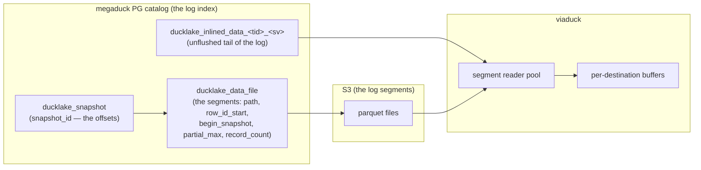

# Viaduck as a consumer fleet over the DuckLake log

Status: PROPOSAL v3.1 (2026-08-15). Two rounds of adversarial review (9
reviewers total), amendments folded. v3 → v3.1: read-loop concurrency
guards, position clustering, inline-row budgeting, encryption mechanics,
observability corrections, spec-first ordering, honest schedule, and the
retention-clamp decision made explicit (§9.0). Per operator direction: no
backwards compatibility with the current implementation; the current
incident is not a design input (see §9.0 for what that accepts); crashes
are rare; per-destination durable cursors are the recovery mechanism.

## 0. TL;DR

DuckLake's snapshot history is a durable, expiring, offset-addressable log.
Viaduck's job is Kafka-consumer-shaped: hold one offset per destination,
fetch offset ranges, write downstream. The current codebase treats reading
as a scarce, scheduled, shared resource — cursor groups, rotation, time
budgets, chunk caps, skip-scan — and that scheduler is what diverges. The
replacement:

1. **The feed**: read the catalog directly (indexed SQL, ~ms) instead of
   the extension's changefeed API (~2.4s fixed per call), and own the data
   plane (parallel parquet reads). The extension API is verified to have
   no configuration escape (§6.1, §10.1).
2. **Shared segments, not scheduled groups**: the read unit is a
   row-bounded range of the log (a "segment"). Destinations at (or near)
   the same offset consume the same segment; a laggard sweeps its own
   range on its own reader. No rotation, budget, or merge/split
   machinery.
3. **Keep the proven delivery core** (buffers, triggers, flush workers,
   adaptive batch cap, circuit breaker, pool, state, lifecycle); delete
   the coupling machinery.

No new durable systems. No Kafka. Crash recovery is the existing
per-destination durable cursor; in-flight state is allowed to be volatile
(§6.5 prices this honestly).

Operating envelope — the system is always in one of three states
(amended per review: B's entry scatters, the loop re-clusters it):

| State | Shape | Read streams |
|---|---|---|
| A. Fleet caught up | everyone at head | 1 shared segment stream |
| B. Fleet catching up (post-downtime) | cursors scattered ~minutes by flush cadence, clustered by the read loop | 1 shared stream per cycle (cluster fan-in, §6.3) |
| C. One laggard | fleet at head + one destination sweeping its backlog | 2 streams (shared + laggard) |

Pathological multi-laggard states (post-crash scatter) degrade to a few
cheap parallel streams that converge — not absorbing, because per-stream
cost no longer divides a fixed serial supply.

## 1. Context: what the current incident measured

(The incident is not a design input — see §9.0 for the decision that
records. These numbers are the evidence base for the cost model. 16.2h
production log, 2026-08-15, viaduck 0.0.70.)

| Quantity | Value |
|---|---|
| Source head rate | 1.53–2.0 snapshots/s |
| Aggregate read coverage | 9.26 snapshots/s |
| Cursor groups | 9; per-group coverage ~1.03 snap/s |
| Divergence | +26 snapshots/min fleet-wide; max_lag 159k → 184k |
| Source retention window | 3 days (~450–520k snapshots) |
| Laggiest cursor | ~26–33h old, aging ~+0.5h/h → crosses the retention edge ~Aug 18–19 |
| Chunk cost model (9,792-sample fit) | **2.3–2.4s fixed/call** + 20–30ms/snapshot + ~0.27ms/row |
| Poll cycles timeboxed | 1125/1125 (100%), 8 groups deferred each |
| Flush health | 100% clean; team-2 p50 15.5s, max 60.6s |
| Destination append cliff (team-2) | 13.2s @30–60k rows, 56.5s @60–90k, 164.4s @90–120k (240s deadline) |
| Memory | ~2.9 GiB/h untracked native residual; 82 GiB self-recycle watermark |

Structural findings:

1. **Group-scan amplification**: N cursor groups each pay full scan cost
   over overlapping spans (a `team_id` filter cannot prune — no
   catalog-level file pruning for CDC scans; zone maps useless at ~142k
   teams/day). Per-group coverage = aggregate ÷ N. Groups merge only at
   the head, so multi-group regimes are absorbing while lagging.
2. **The per-chunk fixed cost** lives in the extension's *bind path*, not
   the catalog: per-bind optimizer-stats registration at the latest
   snapshot + full `COPY TO STDOUT` metadata pulls. **Indices do not
   accelerate the extension path** (§10.1).
3. **Flush↔chunk coupling**: the read chunk is the minimal flush unit, so
   read amortization is fenced by the destination commit cliff. The
   chunk-bump lever is dead (fitted 1.2–1.4× aggregate vs ≥1.9× required).

## 2. The mental model: DuckLake is the log

| Kafka | DuckLake |
|---|---|
| Offset | `snapshot_id` (global, monotone, one per commit) |
| Fetch(offset, max) | Range read `(lo, hi]` → file list + inline rows → parquet bytes |
| Segment | Our read unit: a row/byte-bounded `(lo, hi]` fetch, materialized once |
| Retention | `expire_snapshots(N)` deletes metadata, then files |
| Consumer offset | `viaduck_state.last_snapshot_id` (already exists) |
| Consumer group | The set of destinations sharing a segment — a *sharing set*, not a scheduling structure |
| Compaction | `MERGE_ADJACENT` — invisible by attribution (§3) |

The one imperfection in the mapping: the "topic" is key-filtered (each
consumer wants one `team_id`) and DuckLake has no per-team partitioning,
so a fetch scans the span's full bytes regardless of filter. Affordable
exactly when fetches are cheap — which is what the feed provides.



## 3. Background: DuckLake CDC mechanics (verified against extension source)

Ground truth: deployed extension d8a1881e on duckdb 1.5.5, cross-checked
against the PostHog fork source; citations in `cdc-mark-2.md`, `fixes.md`,
internals verifications 2026-08-15 (×2).

**Snapshots.** One `snapshot_id` per catalog commit, global across tables.
A table's change history is a sparse subsequence — at megaduck's ~1.5–2
commits/s, most snapshots don't touch `events_nrt`.

**File selection semantics** (`GetTableInsertions`,
`ducklake_metadata_manager.cpp`): one range-filtered query —

```sql
WHERE table_id = :t AND begin_snapshot <= :hi
  AND (begin_snapshot >= :lo1
       OR (partial_max IS NOT NULL AND partial_max >= :lo1))
-- lo1 = cursor + 1 (extension is inclusive; viaduck cursors are exclusive)
```

No such index exists today — the extension's own pulls go through
DuckDB's postgres scanner as full COPYs, so it never benefited from one.
The additive index for the feed (corrected INCLUDE list):

```sql
CREATE INDEX CONCURRENTLY viaduck_data_file_range
  ON ducklake_data_file (table_id, begin_snapshot)
  INCLUDE (data_file_id, partial_max, row_id_start, record_count,
           path, path_is_relative, file_size_bytes);
```

**File producer inventory** (verified — load-bearing for attribution):
plain insert/CTAS and `add_data_files` outputs carry no physical snapshot
column; every row is attributed to `begin_snapshot` (for
`add_data_files`: the registration commit — correct log semantics).
`MERGE_ADJACENT` (≥2 sources) outputs: `begin_snapshot =
first_source.begin_snapshot`, `partial_max = max(source snapshots)`,
physical `_ducklake_internal_snapshot_id` + `_ducklake_internal_row_id`,
source catalog rows deleted. Single-source merge edge: `partial_max` is
set only when sources > 1 — a single-source output carries the physical
column but `partial_max NULL`; the extension applies its row filter
*only* under `partial_max NOT NULL`, so the feed's filter must stay
conditional in exactly the same way (parity, not optimization).
`REWRITE_DELETES` outputs: plain-shaped (`begin = commit`, no physical
snapshot column); the insertions predicate has no `end_snapshot` clause,
so rewrite survivors re-deliver — extension-native behavior the feed
inherits identically (pinned by a parity test; tolerable under
at-least-once; irrelevant for append-only sources with no deletes).
Inline-flush outputs: `begin = min`, `partial_max = max` of the physical
snapshot column, which is always written.

**The straddle problem**: a merged/flush file whose `(begin, partial_max]`
window crosses `lo` re-presents delivered rows; one crossing `hi` contains
rows belonging to a later fetch. The extension suppresses both sides with
a **two-sided per-row filter** on the physical snapshot column. The feed
does the same; low-side-only masking over-delivers (Gap A, round 1). For
plain files the low-side filter is vacuous (selection already guarantees
`begin > lo`) — verified.

**Row identity**: plain files — `row_id_start + file_row_number` (0-based,
stock duckdb 1.5.5); merge/flush outputs — physical
`_ducklake_internal_row_id` (catalog `row_id_start` may be NULL); prefer
the physical column when present. Sorted tables: file order ≠ rowid
order.

**Per-row snapshot attribution** (the unlock): every row the feed emits
carries a snapshot id (physical column, else constant `begin_snapshot`,
else inline `begin_snapshot`). The extension's append-only changefeed
never exposed it (`meta_cols=()`, pyducklake `table.py:738`). §6.2 spends
it twice (straddle filter + slice cursors).

**Inline data** (dormant in prod, handled anyway): small commits may land as
rows in `ducklake_inlined_data_<table_id>_<schema_version>`
(`row_id, begin_snapshot, end_snapshot`, + data columns), registered in
`ducklake_inlined_data_tables`. The changefeed unions **all registered
schema versions**, each projected at its own version's columns — the feed
does the same. Inline→parquet migration preserves `(row_id,
begin_snapshot)` attribution (verified), so migrated rows are excluded by
the two-sided filter on their new file. Inline rows have **no**
`record_count` representation — a unit can accumulate up to
`data_inlining_row_limit` × commits-in-range inline rows, and nothing
caps cross-commit accumulation except the flush cronjob; §6.2 budgets
them explicitly. **Prod status (2026-08-15, operator): inlining is
disabled at catalog creation (`data_inlining_row_limit=0`), so the branch
is dormant.** It stays implemented and covered by the golden suite —
config drift, a per-table override, or a future catalog must never turn
into silent row loss; the one-line prod confirmation is that
`ducklake_inlined_data_tables` has no row for our `table_id`.

**`record_count`** (verified): physical rows in the file, exact, never
NULL/stale, across all producer paths (insert, merge, flush,
`add_data_files` via footer). For straddling files it overestimates
*delivered* rows (the filter discards most of the file) — an efficiency
note (track delivered:enumerated ratio), never a correctness or
flush-floor issue.

**Expiry** (verified): `expire_snapshots` deletes snapshot rows, then
unreferenced file rows, then schedules physical deletion — one txn; S3
object deletion is a separate, later, age-gated cleanup. For any range
with `lo >= MIN(snapshot_id)` catalog rows cannot vanish mid-read; the
only race is plan/execute skew (merge commits between list and GET →
source file 404s) — loud, recoverable by re-planning.

## 4. Why the current architecture diverges

`main.py`'s poll loop groups destinations by identical read position, caps
each group at 4 chunks/cycle, checks the 8s cycle budget only between
groups, and rotates. Every mechanism is locally defensible; the
composition yields per-destination throughput =
`aggregate_read_rate ÷ group_count` — 9.26 ÷ 9 ≈ 1.03 snap/s against a
1.53–2.0 snap/s head. The scheduler only ever redistributed a fixed
supply; four scheduling patches in six weeks changed who starves, not
whether anyone does.

## 5. Design principles

- **Reliable**: at-least-once (unchanged contract). Recovery state is the
  durable per-destination cursor. In-flight state may be volatile:
  crashes are rare (clean self-recycle drain for the known RSS residual),
  and §6.5 prices the rewind honestly.
- **Performant**: a consumer's pace is bounded only by its destination's
  append capacity, never by peers.
- **Simple**: delete more than we add; any mechanism that arbitrates
  sharing between destinations is presumed guilty.
- Constraints (operator-set): no Kafka/Warpstream; source Postgres +
  DuckDB/DuckLake API + S3; inline data handled correctly; **no backwards
  compatibility** (hard cutover; the cursor table is data, not compat);
  **spec-first TLA before the read-loop implementation** (AGENT.md).

## 6. The design

### 6.1 The feed (read path)

New `read_feed(lo, hi, routing_values, row_budget)` in `source.py`,
replacing `read_cdc`. Plain psycopg + stock parquet reads; no extension
bind. Surfaces:

1. **Bounds**: `SELECT MIN(snapshot_id), MAX(snapshot_id) FROM ducklake_snapshot`.
2. **Files**: the §3 selection query over the new index (index-only scan).
3. **Inline**: union over all registered inline tables; `COUNT(*)` per
   inline table feeds the unit budget (§6.2). (Implementation note, M1:
   each store is projected with the CURRENT column list — per-schema-
   version column mapping is golden-suite work, and a shape mismatch
   raises loudly rather than drifting. Dormant in prod: inlining is
   disabled at catalog creation.)
4. **Parquet reads**: stock `parquet_scan` over the file list with
   projection pushdown and the `team_id IN (...)` filter, on a reader
   pool (~8 connections) — the extension serializes everything through
   one query slot; the feed's data plane is parallel. `path_is_relative`
   resolution chain (file → table → schema → catalog `data_path`)
   implemented and tested.

Per-row `snapshot_id` is attached during the read (physical column when
present — filtered rows only — else constant `begin_snapshot`; inline
`begin_snapshot`), used transiently for boundary correctness and slicing,
stripped before buffering (destinations must not grow a column).

Boundary correctness (amended per review):

- Files with `partial_max NOT NULL`: two-sided per-row filter
  `:lo < snapshot_id <= :hi`; rowids from the physical column when
  present. The filter is applied **only** under `partial_max NOT NULL`
  (single-source-merge parity, §3).
- Retention clamp semantics preserved: `lo < MIN(snapshot_id)` → clamp
  forward loudly per destination, never silently.
- 404 on a listed file → re-plan the range once, then fail loudly.
- Catalog schema version pinned; unknown version = loud refusal.

Spikes/gates before prod: `mapping_id`/column-rename probe;
single-source-merge `partial_max NULL` probe (pinned by test either way);
prod confirmation that `ducklake_inlined_data_tables` carries no row for
our `table_id` (inlining is disabled at creation — one query);
golden parity suite vs
`table_insertions` — counts AND rowid sets, compaction running, forced
inlining, multi-version inline union, sorted table, straddles both sides,
replay idempotency, 404 drill, `add_data_files` mid-log, boundary
inclusivity, foreign-snapshot noise.

**Encryption** (amended — the round-1 spike text understated it): if
`ducklake_metadata.encrypted = true`, the catalog carries a per-file
random `encryption_key` (base64). The feed must select it, **group the
unit's file list by distinct key**, and run one `parquet_scan` per key
group with `encryption_config := {'footer_key_value': key}`; DuckDB
secrets do not apply (no SQL-side per-file key mapping). Missing key =
loud failure. If unencrypted (expected for megaduck — verify in spike):
select the column unconditionally (NULLs) and take the simple path.

**Resolved spike**: the extension exposes **no setting** to disable
per-bind stats registration — the deployed binary's full settings surface
is `max_retry_count`, `retry_backoff`, `retry_wait_ms`,
`default_data_inlining_row_limit`, `target_file_size`,
`write_deletion_vectors` (verified by symbol inspection of d8a1881e). The
API read path is definitively closed short of upstream action (§10.1).

### 6.2 Read units: row/byte-bounded segments; the slice-cursor rule

A read unit ("segment") extends `hi` from `lo` until a budget trips:
**~50k enumerated rows** (via `record_count`) **or ~256MB** (via
`file_size_bytes`, already in the index INCLUDE list) **or a span cap**
(~a few thousand snapshots — its purpose is bounding inline-row overrun,
GET fan-out, and replay window, per review). Inline rows count toward the
row budget via the per-table `COUNT(*)`.

Consequences:

- The flush floor problem dies: units land under the destination commit
  cliff by construction (50k rows vs the measured 56.5s @60–90k regime
  boundary), and unit size no longer trades against read amortization.
- Read memory is bounded by the budget plus one oversized-file
  materialization (below), not by span density.

**Oversized single files.** A merged compaction output can exceed the
budget alone. It is read with row-group streaming (no whole-file
materialization — `file_size_bytes` gates this), and the routed batch is
sliced per destination into ≤budget buffer entries. Per-row attribution
makes the slice-cursor rule exact (verified sound across six adversarial
traces, including FlushFail mid-sequence):

```
through(slice_k) = max(running_through, min(snapshot_id over slices > k) − 1)
through(last)    = hi
```

computed **per destination over that destination's routed rows**
(post-filter). No row with `snapshot_id <= through(slice_k)` exists in
any later slice, so the durable cursor never passes undelivered data.
Construction invariants (asserted in code): slices non-empty;
`running_through` floored at `lo`; last slice carries `hi`; a flush whose
`through <= lo` is a zombie no-op (monotonic guard) with a counter.

Buffer/position invariants (stated per review):

- `_Buffer.entries` is **non-decreasing** by `through` (two equality
  cases are reachable: min-later = lo+1, and adjacent-unit boundaries).
  The previous "strictly ascending" comment and the TLA model relax to
  match.
- `position` may lead buffered entry throughs only across ranges empty
  for that destination (i.e., `advance_position` is only ever called for
  zero-row units); a full swap asserts
  `position == max(entry throughs)` when the buffer is non-empty.

### 6.3 The read loop: clustered positions, shared segments, parallel pool

Per poll cycle (barrier semantics — specified per review):

```
plan := delivery.read_plan()                    # atomic (position, epoch) per destination
head  := source bounds (sampled ONCE per cycle) # merge precondition
clusters := cluster positions whose ranges fit one budget span,
             each cluster reading from min(position)
for each cluster, dispatched onto the reader pool (~8):
    eligible := members with buffer headroom AND no in-flight read
    seg := read_feed(cluster_min, head, union(routing_values(eligible)), budget)
    per destination d in eligible:
        rows := seg where snapshot_id > plan[d].position   # cluster fan-in mask
        slice rows (§6.2) → delivery.buffer(d, entry, through, epoch=plan[d].epoch)
poll thread, same cycle: delivery.maybe_flush(); health.record_poll()   # unconditional
```

Mechanisms stated per review (all load-bearing):

- **Per-destination in-flight read guard**: a destination with an
  undelivered read is skipped next dispatch. Epochs guard
  read-vs-flush-reset races; they do **not** guard read-vs-read (a slow
  read landing after a faster one would stamp a stale position —
  `buffer()` stamps unconditionally). The guard restores `buffer()`'s
  monotone-stamp precondition; per-position serialization with ordered
  buffer writes is the buffer-invariant precondition.
- **Barrier-per-cycle**: all clusters dispatch each cycle; the pool
  executes 8 at a time; the cycle ends when all complete (unit wall time
  is bounded by the span/byte budget). A continuous-ascending dispatch
  would reintroduce head starvation with polarity flipped — rejected.
  Flush evaluation and heartbeat stay on the poll thread every cycle,
  independent of pool occupancy.
- **Cluster fan-in (State B made real)**: positions within one budget
  span share a segment read from the cluster minimum; per-destination
  masking (`snapshot_id > position`) uses the transient attribution. A
  post-crash scatter of ~240 snapshots collapses in one read instead of
  marching as K streams for hours.
- **Merge condition**: `head` is sampled once per cycle; a position whose
  lag fits one unit clamps to it and lands exactly on the fleet's
  position next cycle.
- **Backpressure**: unchanged — an at-cap destination is excluded from
  the filter, its position frozen (TLA: BufferCap models the exclusion
  within a shared segment explicitly, §6.6).
- **Failure containment**: a read/route failure for one cluster skips it
  for the cycle, nothing fleet-wide (main.py:1554-1571 posture).

### 6.4 Delivery: what survives, what dies

Survives untouched: `apply.append_only`, schema projection, destination
pool (LRU/lease pinning), flush triggers, **the adaptive batch cap**
(AIMD — review-demanded: the 2026-07-30 team-2 wedge was fixed-size
flushes failing forever on a contended catalog; it now adapts batch size
freely, decoupled from chunks), flush circuit breaker, flush deadline,
state manager (+monotonic guard), lifecycle, discovery, reconciler,
server/metrics, read epochs (still the reset guard under parallel
readers).

Dies: rotation offset, cycle time budget, `_MAX_CHUNKS_PER_GROUP_PER_CYCLE`,
skip-scan (uninvolved snapshots are ~free in the feed),
`cdc_chunk_snapshots` (superseded by row/byte budgeting), the
position-grid chunking, group fairness machinery.

### 6.5 Failure modes and crash cost (priced honestly, per review)

| Event | Cost |
|---|---|
| Clean restart / self-recycle | Drain flushes buffers; cursors tight; resume near head. Seconds. |
| Hard crash, healthy fleet | Rewind = buffered window ≤ flush cadence (~120s × 2 snap/s ≈ ~240 snapshots). Re-read at feed speed: seconds. Clustering re-glues in one cycle. |
| Hard crash with an at-cap destination | Worst case rewind = the full per-destination cap: 4GiB ≈ ~4.3M team-2 rows ≈ **~6.7k snapshots ≈ ~1h of head**. Re-read is minutes (feed is cheap); **re-delivery is append-bound, ~16–20 min** at 3.6–4.5k rows/s. Note the crash postures correlate with fat buffers — plan for the at-cap case, not the healthy one. Still not absorbing: the 08-14 catastrophe required the divergence regime. |
| One destination down hours | Cap freezes its position; on recovery it sweeps at its own append rate. Fleet unaffected. |
| Destination down > source retention (3d) | Loud per-destination clamp (data loss acknowledged in state + metrics). **Re-seed is operator-triggered** via the existing seed machinery after cursor reset — there is no automated clamp→re-seed path today; adding one is a separate, costed follow-up (not in this proposal). |
| Feed semantic drift (ducklake upgrade) | Version pin refuses loudly; rollback = redeploy the pinned-previous image (cursors are offsets both sides). |

### 6.6 Correctness contract and verification (spec-first, per AGENT.md)

Unchanged: at-least-once; a flush is one DuckLake txn; commit/cursor-gap
replays duplicate (destinations tolerate).

Invariant carryover from `Viaduck.tla` (the seven current invariants):
EventualConsistency, CursorMonotonicity, FlushStateConsistency,
BufferPositionBound carry; NoPhantomWhenCurrent/NoDataLossWhenCurrent are
re-expressed against the slice-cursor rule; PartitionCorrectness maps to
per-cluster reads. **BufferCap is extended explicitly** to model at-cap
member exclusion within a shared segment (position freezes while peers
advance — new state space). SeedDestination/CrashAfterSeed/PauseDest
actions carry over. New mechanism modeled: segment read with row budget,
the slice-cursor chain, cluster fan-in masking. SQL-level feed parity is
a golden-test property, not a TLC property — stated plainly: the formal
budget covers the cursor machinery, the test budget covers SQL semantics.
**Order: spec change lands and TLC passes before the read-loop
implementation (milestone ordering, §12).**

## 7. Performance model (estimates; assumptions explicit)

Feed cost per unit: ~ms catalog (index-only) + data plane. Data plane is
S3-GET-bound: ~25–30ms/file overlapped across the pool; at ~1.7k
rows/file (time-triggered regime; confirm via
`approx_quantile(record_count)` on prod metadata), 8 readers ≈ ~500k
rows/s GET-side; decode headroom above that. Robust over a 10× band.

- **State A/B**: one clustered stream at ~2 snap/s head — duty cycle a
  few percent (cycle-based, §6.3).
- **State C / catch-up**: bounded by the destination's append rate, not
  reads. team-2-class backlog (~110M rows): ~6.8–8.5h **gross** at
  3.6–4.5k rows/s; **net of live arrivals ~8.3–14.5h** (arrival
  ~0.8–1.5k rows/s), in parallel with the fleet.
- **Load**: megaduck PG work drops ~95–99% (COPY pulls → index probes;
  qps rises slightly, work collapses). Source S3 reads ~1× shared at
  steady state. RSS leak slope (∝ extension bind-path metadata volume)
  should relax materially.
- **The honest ceiling**: the destination append cliff is untouched.
  team-2 caps at ~2.8–3.5× current head growth regardless of the read
  side — separate diagnosis track (§12), not a blocker.

## 8. Operability (corrected per review)

- **Not** "dashboards untouched": the chunk-path series
  (`viaduck_cdc_batch_rows`, `viaduck_cdc_rows_read_total`,
  `viaduck_cdc_read_seconds`) die with the old read path; the dashboard
  slots are remapped to feed metrics. Per-destination delivery series
  (`dest_lag_snapshots`, `dest_time_lag_seconds`, `dest_last_snapshot_id`,
  buffer/flush/circuit) keep names and semantics — they are computed from
  `delivery.status_snapshot()`, which survives.
- New metrics owed (listed so nobody discovers the absence at 3am):
  `viaduck_cdc_feed_query_seconds` / `_files_total` /
  `_inlined_rows_total` / `_divergence_total` (shadow) /
  `_dedup_rows_total`; **per-position count and lag gauges** (the
  absorbing-regime detector — the regression this design exists to kill
  must be alarmed); reader-pool occupancy/queue wait; segment rows/files
  per unit histograms (the §11.3 tuning signal); mid-file slice counter;
  404-replan counter; delivered:enumerated ratio.
- Alerts: feed divergence > 0 (shadow), per-destination retention margin,
  circuit opens, position-cardinality alarm.
- Debug: offsets are explicit; "destination X is wrong" → re-fetch the
  range via the feed and diff.

## 9. Rollout (hard cutover; three images owned and priced)

**§9.0 The retention decision (on the record).** The clamp is automatic
code, not policy. At the measured divergence, the laggiest cursors cross
the 3-day retention edge **~Aug 18–19** — during milestones 1–3 of this
plan. The operator has deprioritized the current incident; that decision
is recorded here with its consequence: **the current backlog is expected
to die at the clamp** (per-destination loss notes in `viaduck_state` +
metrics), and affected destinations will be re-seeded post-cutover
(operator-triggered, existing seed machinery). This proposal does not
race that clock, and nothing in §12 should be read as converging the
current backlog in place. If the org changes its mind, the lever is the
bridge split (§10.3), not schedule compression.

1. Feed + index + spikes. The `CREATE INDEX CONCURRENTLY` on the 22M-row
   `ducklake_data_file` needs a DBA window: two-scan build, brief
   ShareUpdateExclusive locks at start/end, invalid-index risk on
   interruption, permanent maintenance cost under `expire_snapshots`
   churn. Calendar wait is real; start it on day 0.
2. Golden parity suite (fixture matrix of §6.1 — days of work against a
   controllable local DuckLake: compaction running, forced inlining,
   sorted tables, straddles, encryption fixture, budget drills).
3. **TLA replacement first** (per AGENT.md): segment read, slice-cursor
   chain, cluster masking, BufferCap extension; TLC green before the
   read-loop implementation.
4. Read-loop + delivery surgery; deletion pass (see §12 for the test
   churn this implies).
5. **Shadow** (validation scaffolding, owned as a time-boxed third image,
   not a compat shim): old image + feed in dual-read mode, divergence
   counter, 24–48h. Note the shadow pod still leaks ~2.9GiB/h toward its
   self-recycle — comparison continuity across recycles is scripted, not
   assumed. Shadow doubles source read load briefly; acceptable.
   **Operational gate for the shadow window: no source-table DDL.** The
   feed has no `mapping_id`/rename story yet (§11.4) — a mid-shadow rename
   or drop fails loudly (binder error), which is the correct behavior but
   an avoidable alarm.
6. **Cutover rehearsal on a synthetic tenant** (provisioned for the
   purpose — not a customer partition): assignment fencing on both fleets
   (single-master, AGENT.md assumption 3), cutover, **post-cutover audit**
   (destination counts vs source partition for the window), rollback
   drill against the pinned previous image tag. The rehearsal is what
   makes "sacrificial" honest — a hi-side boundary bug is silent without
   the audit.
7. Fleet cutover: stop old, start new; cursors resume; **AIMD cold-start
   prescription**: cap initial flush targets for the cutover window
   (restart resets targets to ceiling — the first post-cutover flushes
   would otherwise run ceiling-sized batches into the measured cliff,
   risking circuit opens during the deepest sweep). Expected fleet state
   at cutover: rolling clamp alarms from the abandoned backlog (§9.0) —
   the cutover playbook is clamp-aware, not surprised.
8. Rollback = redeploy the pinned previous image. Rollback is a
   **correctness escape hatch, not a performance retreat** — the old
   image diverges by design. Free while the old read path exists in the
   rolled-to tag; the deletion pass (step 9) is what ends it.
9. Post-cutover: delete the old read path, group telemetry, and the
   shadow scaffolding; docs (README, AGENT.md, docs/*.d2, grafana JSON).

## 10. Alternatives considered

### 10.1 Keep the DuckLake changefeed API + add indices

Rejected on mechanism, not taste. The ~2.4–3s/chunk is bind-time cost
(stats registration at latest snapshot + full COPY metadata pulls through
DuckDB's postgres scanner); indices don't reach it, and **no configuration
knob exists** (verified by symbol inspection of the deployed binary —
§6.1). The API-preserving fixes are (a) upstream fix (timeline not ours;
one upstream question already outstanding) or (b) a registry-matched fork
build (we then own a C++ pipeline *and* still track upstream — strictly
worse keeping-up burden than a versioned, additive-only catalog schema
with a fail-loud pin and golden tests). The feed's drift surface is three
documented semantics (file selection, merge/flush attribution, inline
union), all pinned by the parity suite; drift announces itself instead of
silently degrading. **Writes are unaffected**: destinations are still
written through the DuckLake API (`tbl.append`, transactions,
retry/circuit machinery) — the direct-SQL path is strictly read-only.

### 10.2 Durable staging log (tailer → per-tenant S3 segments + PG manifest → pull appliers)

Fully designed and adversarially reviewed in this cycle; correct with a
known amendment list. Rejected per operator direction: crashes are rare,
cursors are durable, and §6.5's rewind-cheapness makes a second durable
log dead weight. **Revisit triggers**: destination outages beyond source
retention become routine; per-tenant pod scale-out (whale ladder) needs
its decoupled read path; read↔apply failure isolation becomes
operationally necessary. The amendment checklist is preserved in the
review record; do not rediscover it.

### 10.3 The rest

| Option | Why not |
|---|---|
| Kafka/Warpstream | Operator decision: stay DuckLake-native; the log we need already exists — it's the snapshot history. |
| Sub-chunk flush slicing + chunk bump | Fitted 1.2–1.4× vs ≥1.9× required; mooted by row-bounded units + the attribution-based slice rule (which also closes the slicing blocker class per review). |
| Shared-frontier sweep on the extension API | Keeps the bind tax and the serial data plane; a better tweak, still a tweak. |
| Parallel group readers (FIX-5) alone | Multiplies the expensive read; subsumed — with the feed, parallelism falls out of the pool. |
| Bridge two-pod split | Incident insurance for a deadline this plan explicitly does not race (§9.0). |

## 11. Open questions / spikes

1. ~~`data_inlining_row_limit` on megaduck~~ — resolved (2026-08-15):
   disabled at catalog creation; inline branch dormant. Residual prod
   probe: empty inline registry for our `table_id` (§3).
2. ~~Extension stats-registration knob~~ — resolved (none exists; §6.1).
3. `approx_quantile(record_count, file_size_bytes)` on prod
   `ducklake_data_file` for events_nrt — fixes the budgets and the
   oversized-file streaming threshold; also `target_file_size` on prod.
4. Encryption flag on the prod catalog; `mapping_id`/rename probe.
5. team-2 destination append cliff diagnosis (separate track; the real
   next ceiling).
6. `seed_mode=earliest` semantics: deep history scans work identically
   (the feed reads any retained range); sub-retention is still the bound.
7. Clamp→reseed automation: follow-up candidate, deliberately out of
   scope here (§6.5).

## 12. Milestones (one engineer; corrected per review)

| # | Milestone | Effort (est.) |
|---|---|---|
| 0 | Index build DBA window + spikes (§11.1/3/4) | calendar-bound; start day 0 |
| 1 | Feed reader (§6.1) | 2–3d |
| 2 | Golden parity suite (the §6.1 fixture matrix) | 2–3d |
| 3 | TLA replacement, spec-first (§6.6) | 2–3d |
| 4 | Read-loop + delivery surgery (§6.2–6.4) | 3–4d |
| 5 | Shadow build + 24–48h dual-read soak (§9.5) | 1d + wall clock |
| 6 | Rehearsal (synthetic tenant, fencing, audit) + fleet cutover + rollback drill | 1–2d |
| 7 | Deletion pass: old read path, **106 of 175 test_main.py tests reference the deleted machinery**, README/AGENT.md/docs/dashboards | 2–3d |
| 8 | team-2 append-cliff diagnosis | separate track |

Total: **12–18 working days** plus shadow wall-clock and the index DBA
window. The v3 estimate (7–10d) underpriced the golden suite, the spec
work, the deletion churn, and the shadow's calendar cost.
